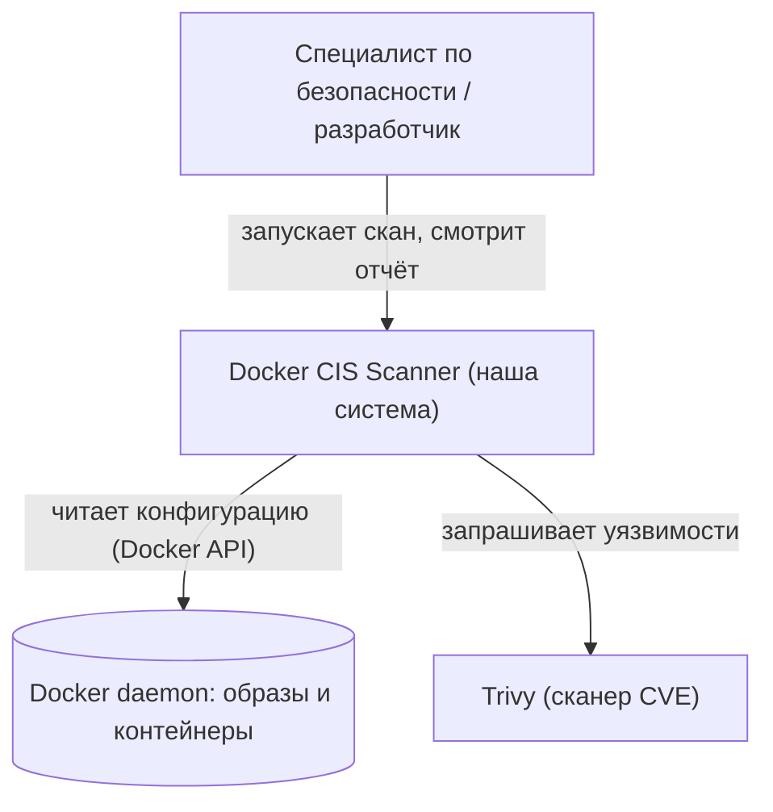
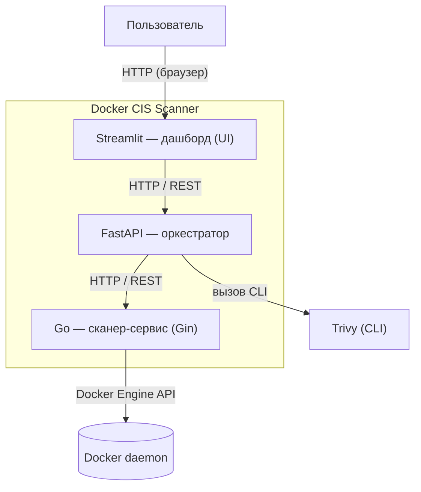
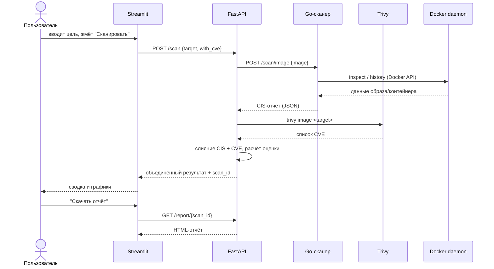
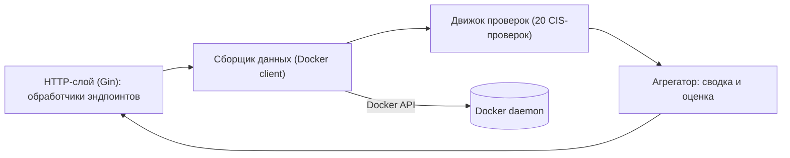

# Диаграммы архитектуры — Docker CIS Scanner

---

## 1. C4 — уровень Context (контекст системы)

Система целиком, кто ей пользуется и с чем она общается снаружи.

---

## 2. C4 — уровень Container (крупные части системы)

Из чего система состоит внутри и по каким протоколам части общаются.

---

## 3. Диаграмма последовательности — сценарий одного скана

Порядок обмена сообщениями во времени.

---

## 4. Компонентная диаграмма — внутреннее устройство Go-сервиса

